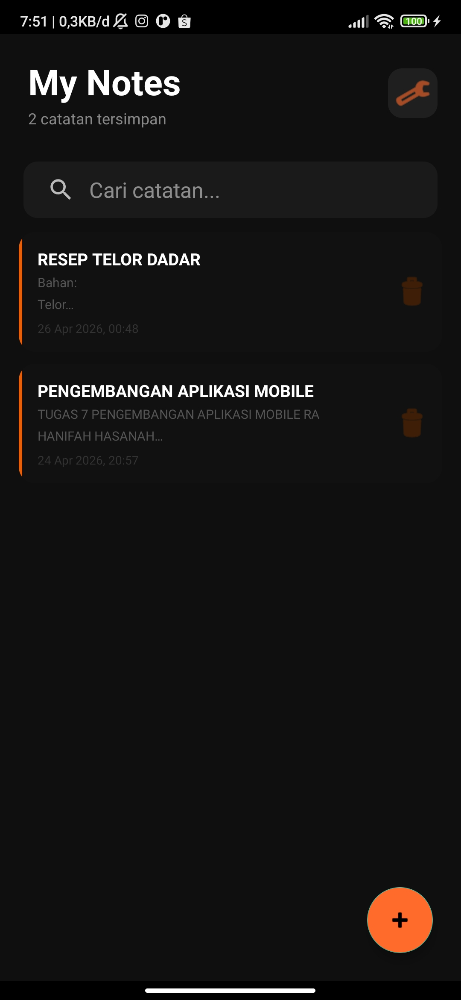
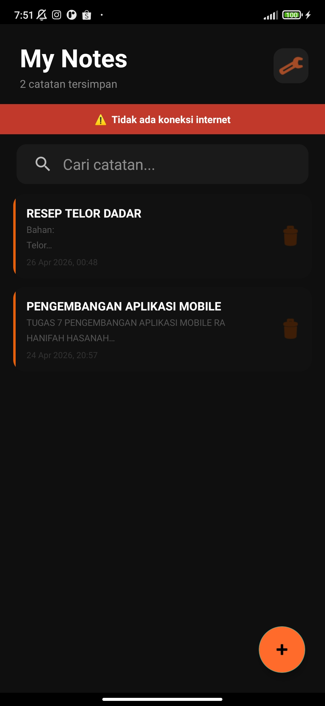
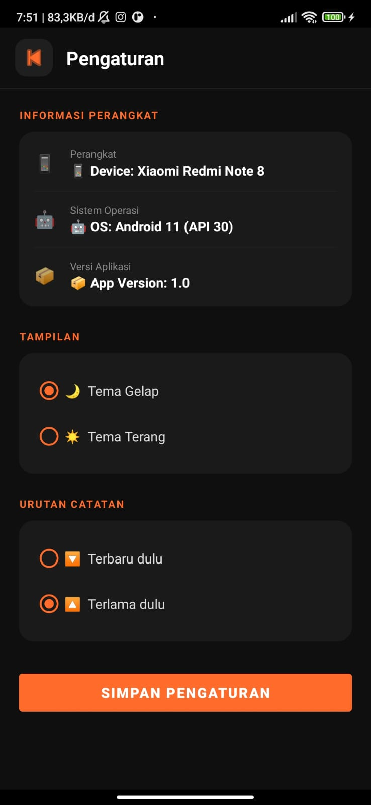
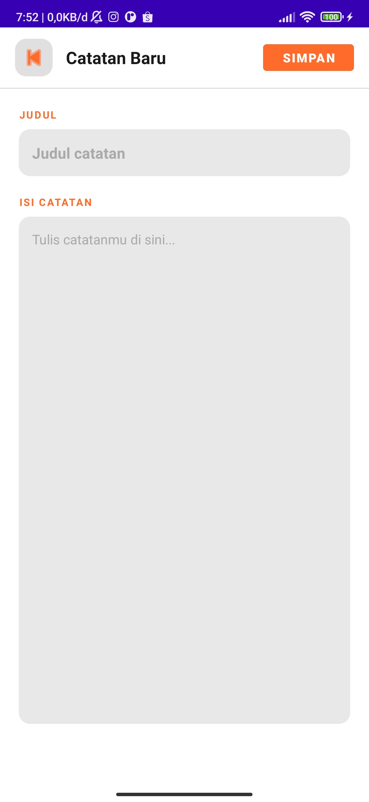

# Notes App - Week 8
**Nama:** Hanifah Hasanah  
**NIM:** 123240082  
**Kelas:** RA

# Notes App - Week 8

## Fitur Baru
- Koin Dependency Injection
- DeviceInfo (simulasi expect/actual)
- NetworkMonitor (simulasi expect/actual)
- Device Info di Settings Screen
- Network Status Indicator di Main Screen
- Light/Dark Theme

## Screenshots

### Main Screen Normal

### Network Indicator

### Device Info

### Layar Catatan Baru + udah dirubah ke terang

## Tech Stack
- Kotlin
- Koin 3.5.0 (Dependency Injection)
- SQLDelight (Database)
- DataStore (Preferences)
- Navigation Component
- ViewModel + LiveData
- StateFlow (Network Monitor)

## Video Demo

▶️ [Klik untuk menonton demo aplikasi](https://drive.google.com/file/d/1p7YTInfosoOP51reD5dtAfW7hf-5qs2e/view?usp=sharing)