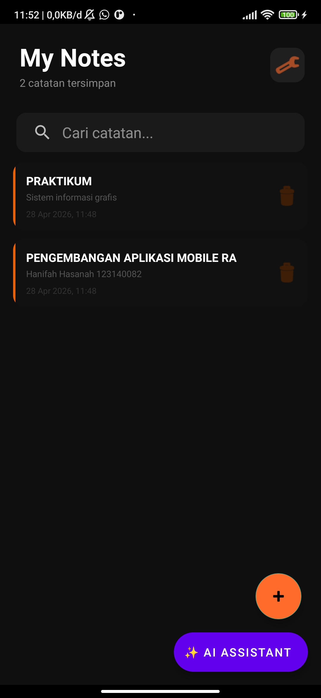
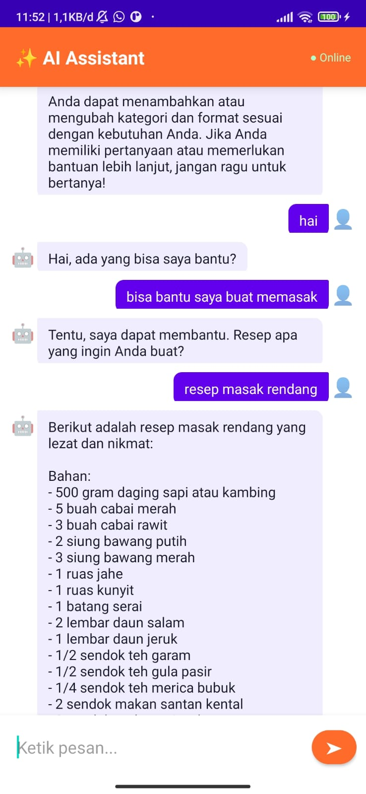

# Notes App NotesApp with AI Assistant - Week 9
**Nama:** Hanifah Hasanah  
**NIM:** 123240082  
**Kelas:** RA

Aplikasi pencatat berbasis Android yang dilengkapi fitur AI Assistant
menggunakan Groq API (LLaMA 3.3).

## ✨ Fitur AI yang Diintegrasikan

### 💬 Smart AI Assistant (Chatbot)
- Pengguna dapat bertanya dan berdiskusi dengan AI langsung di dalam aplikasi
- AI menjawab dalam Bahasa Indonesia dengan ramah dan ringkas
- Mendukung dark mode dan light mode secara otomatis
- Tampilan chat modern dengan bubble message

## 🛠️ Teknologi yang Digunakan
- **Bahasa**: Kotlin
- **AI API**: Groq API (Model: LLaMA 3.3 70B)
- **Min SDK**: 24
- **Target SDK**: 34

## ⚙️ Setup & Instalasi

1. Clone repository ini
2. Buka di Android Studio
3. Buat API key gratis di https://console.groq.com
4. Tambahkan API key di `res/values/strings.xml`:
```xml
   <string name="gemini_api_key">API_KEY_KAMU</string>
```
5. Run aplikasi

## 📱 Cara Menggunakan Fitur AI
1. Buka aplikasi NotesApp
2. Tap tombol **✨ AI Assistant** di halaman utama
3. Ketik pertanyaan di kotak pesan
4. Tap tombol kirim → AI akan menjawab

## 🔧 Error Handling
- Koneksi timeout ditangani otomatis
- Pesan error ditampilkan jika koneksi gagal
- Loading indicator saat menunggu respons AI

## Screenshots

### Tombol AI di Menu Utama



### Balasan Chat AI Berjalan Normal 


## Video Demo

▶️ [Klik untuk menonton demo aplikasi](https://drive.google.com/file/d/1L8cy95Dl0Mr8iqRMbQEdOPlqskssJaCL/view?usp=sharing)