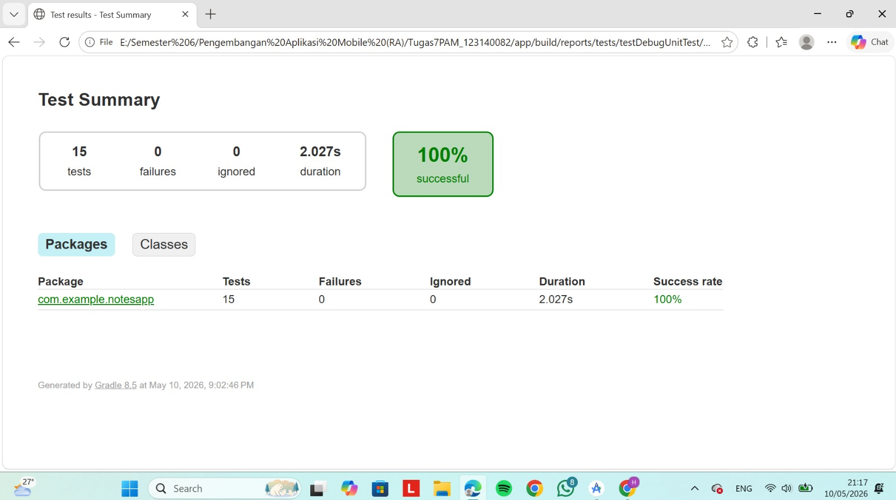
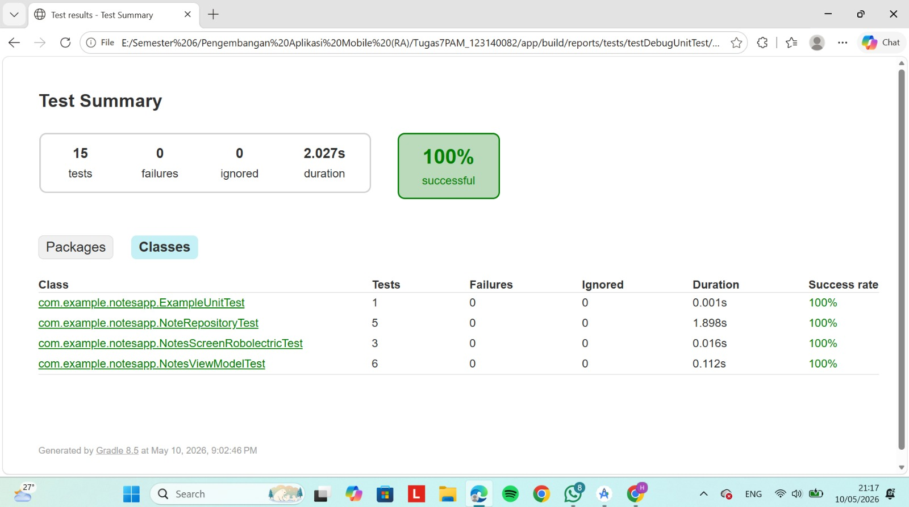
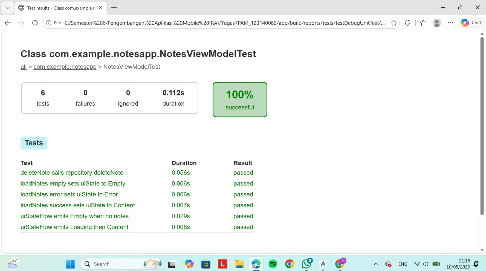

# Tugas Praktikum Minggu 10 - Testing & Dependency Injection
**Nama:** [Hanifah Hasanah]  
**NIM:** 123140082  
**Branch:** week-10

---

## Deskripsi
Implementasi Koin DI dan Testing untuk Notes App Android.

---

## Koin DI Modules
- `dataModule` → NoteDatabase, NoteRepository, DeviceInfo, NetworkMonitor
- `viewModelModule` → NotesViewModel

---

## Daftar Test Cases

### NoteRepositoryTest (5 test cases)
1. `getAllNotes returns list of notes`
2. `getAllNotes returns empty list when no notes`
3. `getNoteById returns correct note`
4. `getNoteById returns null when note not found`
5. `deleteNote calls deleteNote query`

### NotesViewModelTest (7 test cases)
1. `loadNotes success sets uiState to Content`
2. `loadNotes empty sets uiState to Empty`
3. `loadNotes error sets uiState to Error`
4. `deleteNote calls repository deleteNote`
5. `uiStateFlow emits Loading then Content` *(Turbine)*
6. `uiStateFlow emits Empty when no notes` *(Turbine)*

### NotesScreenRobolectricTest (3 test cases)
1. `test_uiState_content_shows_correct_notes`
2. `test_uiState_empty_has_no_notes`
3. `test_uiState_error_has_correct_message`

---

## Test Coverage Report

---

## Hasil Test
- Total: 15 tests
- Passed: 15
- Failed: 0
- Success Rate: 100%