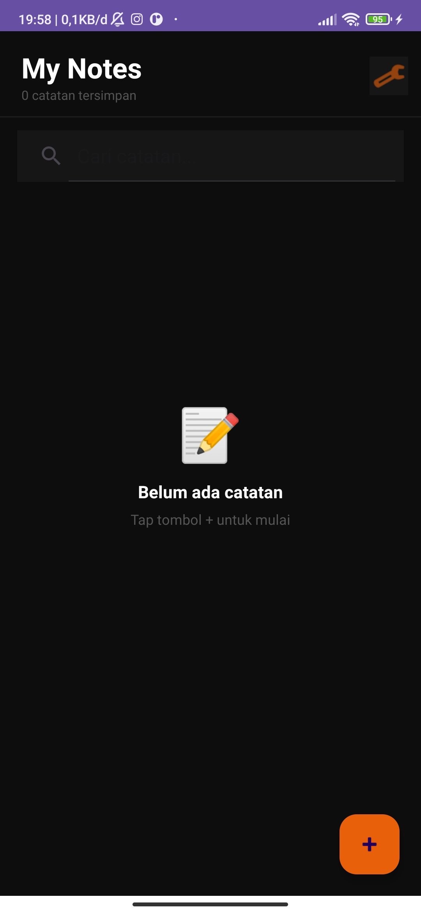

# Notes App - Week 7
**Nama:** Hanifah Hasanah  
**NIM:** 123240082  
**Kelas:** RA

## Database Schema
### Tabel: Note
| Kolom | Tipe | Keterangan |
|-------|------|------------|
| id | INTEGER | Primary Key, Autoincrement |
| title | TEXT | Judul catatan |
| content | TEXT | Isi catatan |
| created_at | INTEGER | Timestamp dibuat |
| updated_at | INTEGER | Timestamp diupdate |

## Fitur
- SQLDelight local database (offline-first)
- CRUD (Create, Read, Update, Delete)
- Search functionality
- Settings (theme & sort order) via DataStore
- UI States: Loading, Empty, Content

## Screenshots

| Home | Tambah | Isi Catatan |
|------|--------|-------------|
|  |  |  |

| Simpan | Setelan |
|--------|---------|
|  |  |

## Video Demo

▶️ [Klik untuk menonton demo aplikasi](https://drive.google.com/file/d/1Q6MXk0V4h5LY-GI-Qu5ZJQbiZ_2sEG2C/view?usp=sharing)